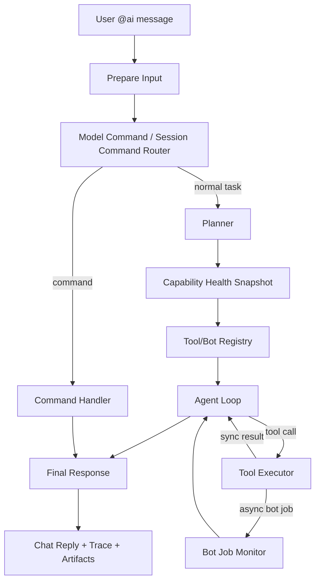

# NasBridge AI Agent Assistant Plan

## 1. 背景

NasBridge 里的 `ai.chat` 最初不是单纯聊天机器人，而是一个本地 NAS 助手入口：它应该能理解用户意图，调用本地 bot、读取文件库、委派下载/转录/总结/音乐控制任务，并把结果沉淀回 storage root 与聊天室。

当前系统已经具备不少基础能力：

- `storage-client/src/bot/runtime.js` 管理 bot job、队列、取消、日志和状态事件。
- `storage-client/src/bot/registry.js` 注册 `ai.chat`、`video.analyze`、`video.tag`、`music.control`、`bilibili.downloader`、`ytdlp.downloader`、`torrent.downloader`、`aria2.downloader` 等插件。
- `storage-client/src/bot/langgraph/` 已经开始把 `ai.chat` 从手写流程拆成图节点。
- `storage-client/src/bot/tools/aiToolRuntime.js` 已经提供一组 AI 可调用工具。
- `storage-client/src/bot/tools/llmClient.js` 负责 OpenAI-compatible、讯飞、Ark、Copilot 等 provider。

但从实际使用看，`ai.chat` 还没有稳定变成一个可依赖的 agent：

- 工具能力散落在 bot plugin、AI tools、自然语言委派和 prompt 规则之间。
- `@ai /model use`、`@ai /model set` 等模型命令容易混淆展示名称和真实模型 ID。
- bot 是否可用缺少统一健康检查，失败常常要从日志里猜。
- 长任务状态、子任务、工具调用结果没有形成统一 trace。
- AI 有时不知道自己能调用哪些 bot，也不知道某个 bot 当前为什么不可用。
- 对不支持 tool-call 的模型，缺少稳定 fallback agent loop。
- 高风险动作缺少统一确认策略和审计记录。

本计划目标是把 `ai.chat` 调整成一个实际可用的 NAS agent 助手。

## 2. 目标

### 2.1 用户体验目标

用户可以用自然语言完成这些任务：

- 找文件：`@ai 找一下最近下载的几个视频`
- 总结视频：`@ai 总结这个视频，并保存摘要`
- 批量整理：`@ai 给最近下载的视频打标签`
- 下载入库：`@ai 去 B 站找某个教程并下载`
- 音乐控制：`@ai 播放周杰伦的晴天`
- 故障解释：`@ai 为什么刚才视频分析失败了`
- 跨步骤任务：`@ai 找最近下载的视频，挑出没有总结的，逐个总结并打标签`

agent 应该能说明：

- 当前准备做什么。
- 调用了哪个 bot/tool。
- 子任务 job id 是什么。
- 任务为什么失败，以及用户该怎么修。
- 哪些动作需要确认。

### 2.2 工程目标

- 把 bot plugin 暴露成统一能力注册表。
- 让 AI tools 从注册表动态生成，而不是靠硬编码 prompt 猜。
- 让 agent loop 可追踪、可恢复、可测试。
- 让模型选择只保存真实可执行的 model id。
- 让健康检查成为 agent 决策的一部分。
- 保留现有 bot runtime、job store、LangGraph 结构，做渐进式改造。

## 3. 非目标

- 不把公网 server 变成长任务执行器。
- 不允许 AI 随意运行本地任意脚本。
- 不在第一阶段追求复杂多 agent 协作框架。
- 不把所有 bot 都改写一遍；先通过 adapter 包装现有能力。
- 不要求所有模型都支持原生 tool-call；需要 fallback。

## 4. 参考模式

可以参考这些社区常见实现思路，但落地以 NasBridge 当前架构为准：

- ReAct / tool-use agent：模型先思考下一步，调用工具，观察结果，再继续。
- LangGraph：把 agent 执行拆成显式节点、状态和可恢复 checkpoint。
- OpenAI-compatible tool calling：使用 JSON schema 描述工具输入，模型返回 tool calls。
- Tool registry / capability registry：工具是可枚举、可校验、可健康检查的能力，而不是 prompt 里的文字约定。
- Planner-executor：复杂任务先生成计划，逐步执行，每步有观察结果和失败恢复。
- MCP-like tool metadata：每个工具提供名称、描述、输入 schema、输出摘要、风险级别、可用性状态。

## 5. 目标架构



### 5.1 Capability Registry

新增统一能力描述层，来源包括：

- bot plugins：`video.analyze`、`video.tag`、`music.control`、`bilibili.downloader` 等。
- local tools：文件索引、文件详情、web search、HTTP fetch、音乐搜索等。
- provider tools：模型列表、模型能力、上下文限制。

每个 capability 至少包含：

```ts
type CapabilityDescriptor = {
  id: string;
  kind: "bot" | "tool" | "model" | "system";
  displayName: string;
  description: string;
  inputSchema: object;
  outputSchema?: object;
  capabilities: string[];
  permissions: string[];
  riskLevel: "low" | "medium" | "high";
  executionMode: "sync" | "async-job";
  timeoutMs?: number;
  requiresConfirmation?: boolean;
  healthChecks: string[];
  examples: string[];
};
```

### 5.2 Health Snapshot

agent 每次执行前能拿到一份轻量健康状态：

- AI provider 是否可用。
- 默认 text / vision model 是否可请求。
- 当前模型是否支持 tool-call。
- `ffmpeg` / `ffprobe` 是否存在。
- Whisper exe 和 model 是否存在。
- `music-lib-bridge` 是否在线。
- QQ cookie 是否存在、最近刷新时间。
- `yt-dlp` 是否存在。
- Bilibili cookie 或 Playwright 是否可用。
- storage root 是否可读写。
- 当前 bot 队列是否繁忙。

健康状态不只是展示给用户，也用于 agent 决策。例如：

- Whisper 不可用时，不要启动 `video.analyze`，先解释缺失项。
- QQ cookie 不可用时，音乐搜索可以尝试公开接口，但要提示会员内容可能失败。
- 模型不支持 tool-call 时，切换到 JSON plan fallback。

### 5.3 Tool Adapter

把 bot plugin 包装成 AI tools：

- `invoke_video_analyze`
- `invoke_video_tag`
- `invoke_music_control`
- `invoke_bilibili_downloader`
- `invoke_ytdlp_downloader`
- `invoke_torrent_downloader`
- `invoke_aria2_downloader`

工具执行不直接吞掉异步 job：

- 短任务可以等待完成。
- 长任务返回 job id、状态、日志入口。
- 用户要求“等它完成”时才持续轮询。

### 5.4 Agent Loop

建议把当前 text tool flow 收敛成显式 loop：

1. `understand_task`
2. `load_context`
3. `plan_next_step`
4. `execute_tool_or_bot`
5. `observe_result`
6. `decide_continue_or_finish`
7. `final_answer`

每一轮写结构化 trace：

```json
{
  "step": 2,
  "phase": "execute_tool",
  "tool": "invoke_video_analyze",
  "inputSummary": "fileId=...",
  "jobId": "botjob_...",
  "status": "queued",
  "startedAt": "...",
  "finishedAt": "",
  "error": ""
}
```

### 5.5 Model Router

模型层需要解决三件事：

1. 保存真实模型 ID，而不是展示名。
2. 标记模型能力：text、vision、tool-call、streaming。
3. 在设置模型时做最小可用性校验。

规则：

- `/models` 从 provider `/models` 返回的 `item.id` 必须作为唯一执行 ID。
- `item.name` 只能作为展示名。
- `@ai /model use <index>` 保存 `provider::modelId`。
- `@ai /model set <name>` 如果输入没有 provider，应优先在最近模型列表里解析为真实 `provider::modelId`。
- 找不到匹配模型时，不直接保存；提示用户先运行 `/models` 或使用 `provider::modelId`。
- 旧缓存里的错误项要能被刷新或迁移。

### 5.6 Safety Gate

按风险级别处理：

- low：读取文件列表、查看摘要、搜索音乐、读取日志，可自动执行。
- medium：下载入库、生成字幕、打标签、写 metadata，默认可执行但要记录审计。
- high：删除、覆盖、批量移动、改名、覆盖大量标签，需要用户确认。

确认信息要包含：

- 影响范围。
- 目标文件数量。
- 是否可恢复。
- 预计耗时。

### 5.7 NAS File Access Layer

AI bot 对 NAS 文件本身的访问应该是 agent 的核心能力，但不能等同于“把 `STORAGE_ROOT` 全量暴露给模型”。目标是提供一个受控的文件访问层：

1. AI 通过索引、`fileId` 和相对路径访问文件。
2. AI 默认看到的是文件 metadata、摘要、标签、字幕、预览文本和可控长度的内容片段。
3. AI 不直接获得任意本地绝对路径，也不能绕过 `safeJoin` 读写 `STORAGE_ROOT` 外的文件。
4. 大文件、二进制文件、视频、音频、图片通过专门工具抽取信息，不直接塞进模型上下文。
5. 写操作必须走明确工具、权限、风险分级和审计。

当前已有基础：

- `list_storage_files`：按关键词、目录、类型、MIME、是否已有 AI 总结或字幕筛选文件库。
- `get_storage_file_details`：按 `fileId` 或相对路径读取文件详情、已有摘要和字幕 sidecar。
- `analyze_storage_video`：对视频/音频委派 `video.analyze`，生成字幕和 AI 总结。
- `video.tag`：根据字幕或摘要写入标签。
- `safeJoin`：用于限制相对路径不能逃逸 storage root。

还需要补齐的能力：

```ts
type FileAccessPolicy = {
  root: string;
  allowedRoots: string[];
  hiddenDirs: string[];
  maxListResults: number;
  maxInlineTextChars: number;
  maxBatchFiles: number;
  allowRawTextRead: boolean;
  allowBinaryRead: false;
  writeRequiresConfirmation: boolean;
};
```

建议新增或整理这些工具：

- `search_library_files`：更强的文件搜索，支持路径、扩展名、时间、大小、标签、是否已有摘要。
- `read_file_metadata`：只读 metadata，不读正文。
- `read_text_excerpt`：读取文本/字幕/markdown/pdf 提取文本的片段，带最大字符数和分页。
- `read_media_summary`：读取已有 `aiSummary`、字幕、封面、时长、分辨率、音轨等派生信息。
- `analyze_file_content`：根据文件类型选择合适分析器，视频走 Whisper，图片走视觉模型，文档走文本抽取。
- `update_file_metadata`：写标签、摘要、备注，medium risk，写审计。
- `organize_files`：移动/重命名/批量整理，high risk，必须确认。
- `explain_file_access`：告诉用户 AI 当前能看到什么、不能看到什么、为什么。

文件访问分层：

| 层级 | AI 可见内容 | 示例 | 风险 |
| --- | --- | --- | --- |
| Index | 文件名、路径、大小、MIME、mtime、标签、摘要状态 | 找最近下载的视频 | low |
| Metadata | 时长、分辨率、hash、已有摘要、字幕路径 | 判断是否需要重新总结 | low |
| Excerpt | 文本片段、字幕片段、PDF 抽取片段 | 总结文档一部分 | low/medium |
| Derived Content | Whisper 字幕、AI summary、图片描述 | 总结视频、给图片归类 | medium |
| Write Metadata | 标签、摘要、备注、收藏状态 | 给视频打标签 | medium |
| File Mutation | 移动、重命名、删除、批量整理 | 清理下载目录 | high |

agent 的默认策略：

- 先搜索索引，再读取详情，不凭聊天记录猜文件。
- 只有用户指向明确文件或搜索结果足够明确时，才进入内容读取或分析。
- 读取正文前先判断文件类型和大小，必要时分页/抽样。
- 视频和音频优先复用已有 `.srt` / `aiSummary`；没有时再启动 `video.analyze`。
- 对多个候选文件，先列出候选并说明选择依据，避免误操作。
- 修改文件、移动文件、删除文件、覆盖标签前必须给用户确认。

健康检查需要覆盖文件访问：

- `STORAGE_ROOT` 是否存在、可读、可写。
- 文件索引是否可扫描，最近扫描时间。
- 隐藏目录和缓存目录是否正确排除。
- 大文本抽取、字幕读取、PDF/Office 抽取能力是否可用。
- `fileId -> absolutePath` 是否能稳定解析。

## 6. 分阶段计划

### Phase 0: 稳定当前基础能力

目标：先让现有功能少踩坑。

任务：

- 修正模型设置逻辑，避免展示名进入执行路径。
- 给 `@ai /model set` / `set-all` / `set-vision` 增加模型解析和校验。
- 加入 `@ai /models refresh` 或每次 `/models` 强制刷新缓存。
- 清理 `ai-model-settings.json` 里旧的无效模型项。
- 在启动日志里输出 AI provider、默认模型和模型可用性摘要，不输出 key。
- 对 `AI model request failed` 做更友好的错误解释。

验收：

- `@ai /models` 显示的每个模型都对应真实可请求 ID。
- `@ai /model use 1` 后，视频总结不会再因为展示名失败。
- `@ai /model set DeepSeek V4 Pro` 会解析到 `openai::deepseek-v4-pro`，或提示无法解析。

### Phase 1: Capability Registry 和 Health Check

目标：让系统知道自己有哪些能力，以及每个能力当前是否可用。

任务：

- 新增 `src/bot/capabilities/registry.js`。
- 从现有 plugin 自动生成 capability descriptor。
- 给每个 bot 增加 `healthCheck(api)` 或外部 health checker。
- 新增 `@ai /tools` 命令，展示工具列表和可用状态。
- 新增 `@ai /health` 命令，展示 AI / Whisper / ffmpeg / music bridge / yt-dlp / cookies 等状态。
- 在 `@ai /health` 中加入 NAS 文件访问状态：storage root、索引、读写权限、索引更新时间。
- 将 health snapshot 注入 `ai.chat` prompt 和 agent state。

验收：

- 用户能一眼看到“视频总结不可用是因为 Whisper 缺模型”之类原因。
- AI 在调用工具前能主动避开不可用能力。
- AI 能说明当前是否能读取/分析 NAS 文件，以及不能访问的原因。
- health 输出不包含密钥和完整 cookie。

### Phase 2: Bot Tool Adapter

目标：让 AI bot 通过统一 tool 接口调用其他 bot，而不是靠散落的特殊分支。

任务：

- 新增 `src/bot/tools/botToolAdapter.js`。
- 为每个 bot 生成 OpenAI tool schema。
- 支持 sync/async 两种执行模式。
- 长任务返回 `jobId`、`status`、`logHint`、`nextAction`。
- 对 `video.analyze`、`video.tag`、`music.control` 先做第一批 adapter。
- 将文件访问工具整理为第一等 tools：搜索、详情、片段读取、metadata 写入。
- 保留现有自然语言委派作为 fallback。

验收：

- AI 可以通过 tool call 调起 `video.analyze`。
- 子任务 job id 能显示在最终回复和 trace 里。
- AI 可以稳定完成“搜索文件 -> 读取详情 -> 复用摘要/字幕 -> 必要时分析”的链路。
- 用户可以继续追问“刚才那个任务怎么样了”。

### Phase 3: Agent Loop 重构

目标：把 AI bot 从“一次性问答 + 部分工具调用”提升为可持续执行的 agent。

任务：

- 在 LangGraph 中新增显式节点：
  - `PlanNode`
  - `ToolSelectNode`
  - `ToolExecuteNode`
  - `ObserveNode`
  - `ContinueOrFinishNode`
- 统一最大轮数、超时、取消、错误恢复策略。
- 支持 tool-call 模型直接调用工具。
- 支持非 tool-call 模型 JSON plan fallback。
- 每轮写入 trace 文件。
- 对长任务可选择：
  - 提交后立即回复。
  - 等待完成。
  - 等待到某个阶段后回复。

验收：

- `@ai 找最近下载的视频，给没有总结的生成总结` 可以拆成多步。
- `@ai 这个目录里有哪些值得整理的文件` 会先搜索/读取 metadata，而不是臆测。
- 中途失败时能看到失败在第几步、哪个工具、哪个 job。
- `cancel-bot-job` 能取消 agent 本身和当前子任务。

### Phase 4: Prompt 和任务预设

目标：让 agent 真的像 NAS 助手，而不是普通聊天模型。

任务：

- 重写 system prompt：
  - 明确身份：本地 NAS agent。
  - 明确能力：搜索 NAS 文件、读取 metadata、读取内容片段、分析视频/图片/文档、音乐、下载、整理、日志。
  - 明确边界：高风险操作要确认。
  - 明确工具优先级：先查健康和文件索引，再选最小工具。
- 增加任务模板：
  - 文件搜索和内容读取模板。
  - 视频分析模板。
  - 音乐播放模板。
  - 文件查找模板。
  - 下载入库模板。
  - 故障诊断模板。
- 将 capability examples 自动注入 prompt。

验收：

- 用户不用记 bot 名称，直接说自然语言即可。
- AI 不再经常“建议你手动执行某某 bot”，而是自己调工具。
- AI 能在工具不可用时给出具体修复步骤。

### Phase 5: 前端状态和日志体验

目标：让用户看得见 agent 在做什么。

任务：

- bot 状态卡展示 agent plan。
- 每个 tool/sub-job 显示状态、耗时、可打开日志。
- `open-bot-log` 不只看 ai.chat，也能跳到子任务日志。
- 终端日志继续保留结构化 `[bot-job]` / `[bot-log]`。
- 前端提供“继续等待”、“取消任务”、“重试失败步骤”按钮。

验收：

- 长任务不再像卡住。
- 用户能从聊天卡片直接打开完整 trace。
- 失败任务能一键重试可恢复步骤。

### Phase 6: 评测和回归测试

目标：让 agent 改造后能长期维护。

任务：

- 单测：
  - 模型解析。
  - capability registry。
  - health checker。
  - tool adapter。
  - risk gate。
- 集成测试：
  - 模拟 AI tool-call。
  - 模拟非 tool-call JSON plan。
  - 模拟 video.analyze 子任务。
  - 模拟 music.control。
- 本机 smoke test：
  - `@ai /health`
  - `@ai /tools`
  - `@ai /models`
  - `@ai /model use <index>`
  - `@ai 找最近下载的 5 个视频`
  - `@ai 读取这个文档的前 2000 字并总结`
  - `@ai 总结这个视频`
  - `@ai 播放一首歌`

验收：

- 每次改 bot/agent 核心后，能用测试快速发现模型、工具、委派、日志回归。

## 7. 关键设计细节

### 7.1 模型 ID 与展示名

必须区分：

- `modelId`: provider 实际请求时使用的 ID，例如 `deepseek-v4-pro`。
- `displayName`: 给用户看的名称，例如 `DeepSeek V4 Pro`。
- `modelRef`: 带 provider 的完整引用，例如 `openai::deepseek-v4-pro`。

执行路径只允许使用 `modelId` 或 `modelRef`。

### 7.2 Tool-call fallback

不是所有 OpenAI-compatible provider 都稳定支持 tool-call。fallback 策略：

1. 如果模型支持 tool-call，走原生工具调用。
2. 如果不支持，要求模型输出严格 JSON：

```json
{
  "action": "call_tool",
  "tool": "invoke_video_analyze",
  "arguments": {
    "fileId": "..."
  }
}
```

3. 本地解析 JSON，校验 schema 后执行。
4. 如果 JSON 不合法，最多重试一次，仍失败则回退成普通回答。

### 7.3 任务恢复

agent trace 应该记录：

- agent job id。
- 子 bot job ids。
- 每轮模型输出摘要。
- 每次工具输入摘要。
- 工具结果摘要。
- 当前是否可重试。

这样 `@ai 继续刚才的任务` 才有基础。

### 7.4 与现有 LangGraph 的关系

已有 `storage-client/src/bot/langgraph/` 可以保留，不建议推倒重来。

改造方向：

- `prepareInputNodes.js` 继续负责输入、session、显式命令。
- `commandNodes.js` 负责命令，但模型命令要接入 model resolver。
- `textNodes.js` 逐步从“直接模型回复”变成“agent loop 入口”。
- `toolConversation.js` 逐步变成 tool-call 执行器的一部分。
- `aiToolRuntime.js` 被 capability registry + bot adapter 替代或扩展。

## 8. 风险和注意点

- 长任务不能占死普通 bot 队列，视频/Whisper 仍需要独立队列。
- prompt 不能塞太多工具详情，否则上下文会膨胀。
- health check 不能每轮做重型检查，应该有短 TTL 缓存。
- AI 不应直接拿到本地绝对路径，除非工具确实需要并经过权限校验。
- cookie、key、token 不得进入 trace、chat reply 或终端日志。
- 旧的 `ai-model-settings.json` 需要兼容迁移。
- 前端和 storage-client 的 bot catalog 协议要保持兼容。

## 9. 推荐实施顺序

优先级建议如下：

1. Phase 0：模型 ID 修正和模型设置校验。
2. Phase 1：`@ai /health`、`@ai /tools`、capability registry。
3. Phase 2：先包装 `video.analyze`、`music.control`、`bilibili.downloader`。
4. Phase 3：引入 agent loop 和 trace。
5. Phase 4：重写 prompt 与任务模板。
6. Phase 5：前端状态卡与日志体验。
7. Phase 6：测试与评测。

第一批可以先做到：

- `@ai /health`
- `@ai /tools`
- `@ai /models` 真实 ID 校验
- `@ai 总结这个视频` 稳定调用 `video.analyze`
- `@ai 播放一首歌` 稳定调用 `music.control`
- 失败时能明确说明缺什么配置或哪个 job 失败

这会把 `ai.chat` 从“能聊天，也许能调工具”推进到“能自检、能委派、能解释失败”的可用 agent。
