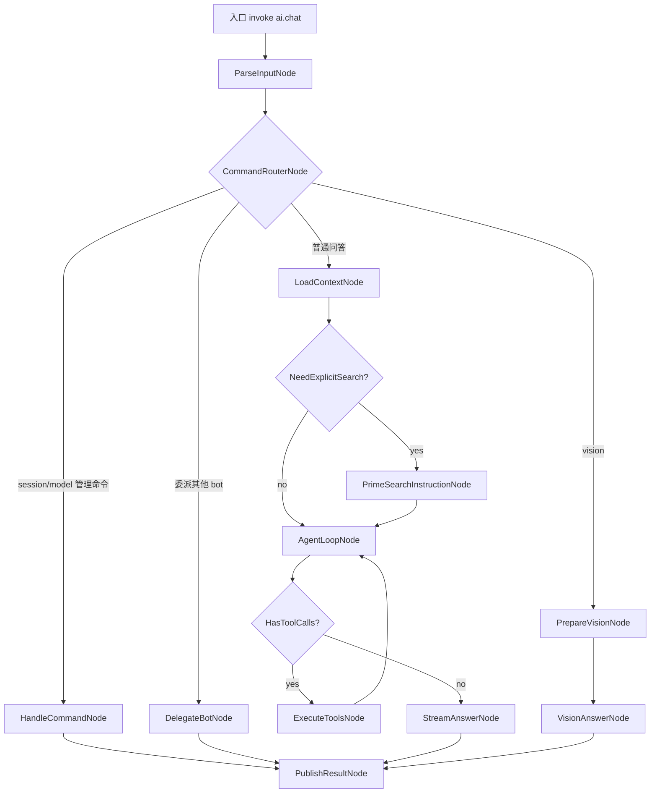

# LangGraph.js 迁移草图

## 目标

把当前 `storage-client/src/bot/plugins/ai-chat.js` 里的自定义 AI 执行链，迁移成基于 LangGraph.js 的可组合图执行模型，同时尽量保留现有这些能力：

- 聊天会话与上下文拼装
- 普通文本问答
- 多轮 tool calling
- `/search` 显式联网搜索
- 图片理解
- 嵌套 bot 委派
- 聊天消息发布与流式草稿输出
- 任务取消、日志、进度与审计

迁移后优先解决的不是“功能更多”，而是这几个结构性问题：

- 当前控制流集中在单文件内，分支多，扩展一个新能力容易继续堆 if/else
- tool 调用、搜索跟进、流式回复、委派 bot、视觉模式分散在同一执行路径里，排错成本高
- 运行日志只有串行 append，像 `failed: terminated` 这种问题很难快速定位到哪一个阶段中断
- 现有逻辑已经接近一个状态机，但状态没有被显式建模

## 当前实现概览

现状里的关键职责分布如下：

| 当前文件 | 当前职责 | 迁移后建议 |
| --- | --- | --- |
| `src/bot/runtime.js` | bot job 生命周期、取消、日志、进度、reply 发布 | 保留为最外层 job shell，不直接承载 AI 控制流 |
| `src/bot/plugins/ai-chat.js` | 输入解析、session 管理、模型命令、tool 回合、vision、search、最终回复 | 拆成 LangGraph 入口 + 若干 graph node/helper |
| `src/bot/tools/llmClient.js` | OpenAI-compatible 请求封装、stream、tool schema 注入 | 保留为 provider adapter，LangGraph model wrapper 复用它 |
| `src/bot/tools/aiToolRuntime.js` | tool 定义与执行 | 保留为 tool registry/executor，并包装成 LangGraph ToolNode 可调用形式 |
| `src/bot/tools/chatHistory.js`、`chatAssets.js`、`realtimeContext.js` | 上下文输入源 | 作为 graph 的 context-loading nodes 使用 |

当前最核心的 AI 主链，本质上接近下面这条手写状态流：

1. 解析 prompt、session、model 指令
2. 判断是否是管理命令
3. 判断是否要进入 vision
4. 判断是否要走显式 `/search`
5. 组织历史消息与 system prompt
6. 调用模型拿到 tool calls
7. 串行执行工具
8. 回写 planning messages
9. 最终流式输出回复
10. 发布 chat reply / card

这正是 LangGraph.js 适合接手的场景。

## 目标图结构

建议把 `ai.chat` 迁移成一个显式图，而不是继续在 plugin 内堆控制分支。



这个图不是为了“好看”，而是为了把当前隐含的状态转成可追踪的节点边界。迁移完成后，`failed: terminated` 至少可以被细化为：

- terminated in `LoadContextNode`
- terminated in `AgentLoopNode` while waiting model response
- terminated in `ExecuteToolsNode` for `search_web`
- terminated in `StreamAnswerNode`

## 建议目录草图

最初目标结构如下，作为长期拆分方向保留：

```text
storage-client/src/bot/langgraph/
  aiChatGraph.js
  state.js
  adapters/
    llm.js
    tools.js
    progress.js
  nodes/
    parseInputNode.js
    commandRouterNode.js
    handleCommandNode.js
    loadContextNode.js
    primeSearchInstructionNode.js
    agentLoopNode.js
    executeToolsNode.js
    streamAnswerNode.js
    prepareVisionNode.js
    visionAnswerNode.js
    delegateBotNode.js
    publishResultNode.js
  reducers/
    messagesReducer.js
    artifactsReducer.js
  checkpoints/
    aiSessionCheckpointer.js
```

当前代码已落地到下面这组实际文件，已经不再是单个 `aiChatNodes.js` 承载全部 route：

```text
storage-client/src/bot/langgraph/
  aiChatGraph.js
  state.js
  checkpoints/
    aiSessionCheckpointer.js
  nodes/
    aiChatNodes.js
    commandNodes.js
    prepareContextNodes.js
    prepareInputNodes.js
    recoveryNodes.js
    textNodes.js
    visionNodes.js

storage-client/src/bot/plugins/
  ai-chat.js
  ai-chat/
    delegation.js
    recovery.js
    streaming.js
    toolConversation.js
    constants.js
    formatters/
    parsers/
    selectors/
    services/
    utils/
```

当前职责落点：

- `plugins/ai-chat.js`: 已缩成插件入口，只负责把执行交给 `runAiChatGraph`
- `langgraph/nodes/aiChatNodes.js`: 现在只保留 delegate 两段和 handlers 装配
- `langgraph/nodes/commandNodes.js`: 会话命令和模型命令处理
- `langgraph/nodes/prepareInputNodes.js`: 输入解析、route 选择、session 恢复调度
- `langgraph/nodes/prepareContextNodes.js`: 聊天上下文加载和 system prompt 组装
- `langgraph/nodes/recoveryNodes.js`: 恢复策略推导和 recovery route 输出
- `langgraph/nodes/textNodes.js`: 文本规划、多轮工具执行衔接、最终文本回答
- `langgraph/nodes/visionNodes.js`: 图片收集、vision input 构造、看图回答
- `plugins/ai-chat/delegation.js`、`plugins/ai-chat/streaming.js`: 委派与流式输出这类跨 route 运行时能力

其中职责边界建议如下：

- `aiChatGraph.js`: 组装 StateGraph、定义节点与条件边
- `state.js`: 定义 graph state 结构、默认值、merge 规则
- `adapters/llm.js`: 把现有 `llmClient.js` 包成 LangGraph 可调用 model adapter
- `adapters/tools.js`: 把现有 `getAiToolDefinitions/executeAiToolCall` 包成 tool registry
- `adapters/progress.js`: 把 LangGraph node 生命周期映射到 `api.emitProgress/appendLog`
- `checkpoints/aiSessionCheckpointer.js`: 把当前 session 持久化能力接到 graph checkpoint 上
- `nodes/*`: 每个节点只做一件事，输入输出只改 state

## State 设计

建议先把 AI 图的 state 固定下来，后续所有节点都只读写这一个对象。

```js
{
  jobId: string,
  chatId: string,
  sessionId: number | null,
  mode: "text" | "vision" | "command" | "delegated",
  rawPrompt: string,
  effectivePrompt: string,
  command: null | { type: string, ... },
  modelOverride: string,
  selectedTextModel: string,
  selectedVisionModel: string,
  historyMessages: Array,
  planningMessages: Array,
  toolDefinitions: Array,
  pendingToolCalls: Array,
  toolResults: Array,
  recentMessages: Array,
  imageInputs: Array,
  search: {
    explicit: boolean,
    preferredSource: string,
    forcedFirstTool: string,
  },
  answer: string,
  streamedText: string,
  replyDraftId: string,
  replyCard: object | null,
  delegatedJob: object | null,
  artifacts: Array,
  trace: Array,
  error: null | {
    node: string,
    message: string,
    cause: string,
  }
}
```

迁移时最重要的一点是：

不要再让任意 helper 随意拼局部对象返回，而要让所有节点只更新 state 上的固定字段。这样才能让可视化、回放、诊断和 checkpoint 真正稳定下来。

## 各部分替换方案

### 1. `ai-chat.js` 的入口层

当前职责过重，建议最终只保留三类内容：

- bot plugin 元数据
- 极少量兼容层 helper
- 调用 graph 的入口函数

建议替换成：

```js
export const aiChatPlugin = createBotPlugin({
  botId: "ai.chat",
  async execute(context, api) {
    return runAiChatGraph({ context, api });
  }
});
```

也就是把今天 `ai-chat.js` 里的主流程，整体下沉到 `langgraph/aiChatGraph.js`。

### 2. session/model 指令处理

当前散落在 `parseAiSessionDirective`、`parseModelDirective`、一组 `read/writeAiModelSettings` helper 中。

建议拆成两个节点：

- `ParseInputNode`
  - 解析 `rawPrompt`
  - 把 session 指令、model 指令、显式 `/search` 指令写入 state
- `HandleCommandNode`
  - 只负责命令类回复
  - 输出统一的 `answer/replyCard/artifacts`

替换原则：

- 保留当前 helper 逻辑，不重写业务规则
- 先把 helper 从 `ai-chat.js` 挪到 `nodes/helpers` 或 `services` 中
- 再让 `HandleCommandNode` 调用这些 helper

### 3. 上下文加载与 prompt 组装

当前在 `ai-chat.js` 中直接读：

- recent chat history
- referenced attachments
- session history
- realtime context

建议替换成 `LoadContextNode`，输出这些 state 字段：

- `recentMessages`
- `historyMessages`
- `imageInputs`
- `toolDefinitions`
- `effectivePrompt`
- `selectedTextModel`
- `selectedVisionModel`

替换策略：

- 直接复用现有 `readRecentChatHistory`、`listReferencedChatAttachments`、`buildRealtimeContextText`
- 不在第一期改它们的实现，只改变调用位置
- 所有上下文拼接都在这一个节点集中完成

### 4. LLM 调用层

当前 `llmClient.js` 已经做得比较干净，不建议推倒重写。

建议改法：

- 保留 `invokeTextModel`
- 保留 `invokeTextModelStream`
- 保留 `invokeMultimodalModel`
- 保留 `invokeMultimodalModelStream`
- 在 `langgraph/adapters/llm.js` 上再包一层，提供给 graph 节点使用

建议新增两个适配函数：

- `callTextAgentStep(state, options)`
- `streamFinalAgentAnswer(state, options)`

这层适配的价值是把 LangGraph state 映射到现有 OpenAI-compatible messages，不把 graph 逻辑直接塞进 `llmClient.js`。

### 5. tool calling 替换

当前工具机制已经具备两件最关键的东西：

- `getAiToolDefinitions()`
- `executeAiToolCall(toolCall, context, api, extra)`

所以这里不应该重写工具，只应该把工具接成 graph 节点。

建议结构：

- `AgentLoopNode`
  - 调模型
  - 解析 tool calls
  - 写入 `pendingToolCalls`
- `ExecuteToolsNode`
  - 顺序执行 `pendingToolCalls`
  - 结果写入 `toolResults`
  - 同时把 tool result 回填到 `planningMessages`
  - 清空 `pendingToolCalls`

替换要点：

- 第一阶段继续保留“串行工具执行”语义，避免行为变化过大
- `MAX_TOOL_ROUNDS` 迁到 graph config
- 每次工具执行都记录 node 级 trace 与 tool 级 trace
- `search_web` 的 follow-up 决策继续先保留在工具内部，不要一开始就拆散

### 6. `/search` 显式搜索路径

当前已经从“硬编码三段式”改成了“强制先 search_web，再继续模型决策”。这个方向是对的。

迁移后建议这样建模：

- `ParseInputNode` 识别 `/search`
- `PrimeSearchInstructionNode` 给 state 写入：
  - `search.explicit = true`
  - `search.forcedFirstTool = "search_web"`
  - 一个额外 system instruction，要求第一轮必须先调用 `search_web`
- 后续仍然进入同一个 `AgentLoopNode`

这样 `/search` 就不再是旁路流程，而只是普通图上的一个特殊状态。

### 7. vision 流程替换

当前 `wantsVision`、`toDataUrl`、`streamVisionAnswer` 也都在 `ai-chat.js` 里。

建议拆成：

- `PrepareVisionNode`
  - 整理图片输入
  - 校验数量和大小
  - 选择 multimodal model
- `VisionAnswerNode`
  - 调 `invokeMultimodalModelStream`
  - 实时更新 `streamedText`
  - 结束后写 `answer/replyCard`

替换原则：

- 第一版维持 vision 独立旁路，不强求它与 tool loop 合并
- 等 text graph 跑稳后，再考虑把 image describe 也纳入统一 agent loop

### 8. nested bot 委派

当前 `delegateBotInvocation` 已经很清晰，适合直接转成一个节点。

建议：

- `CommandRouterNode` 在早期识别显式 `@otherbot`
- 或者在文本回答后保留一个 `FindDelegationIntentNode`
- 第一版先只迁移“前置显式委派”，不要保留“模型答完后再从答案中抽委派”这种隐式行为

原因很直接：

- 这类后置隐式委派不够稳定
- 它会让 graph 的终态不是终态，调试复杂度会上升

如果必须保留，可以二期再恢复。

### 9. 流式回复与草稿发布

当前做法是边 stream 边调用 reply 草稿/消息发布逻辑。迁移后不要改掉这个用户体验，但要把职责拆开：

- `StreamAnswerNode` 只负责消费模型 stream
- `PublishResultNode` 负责最终 message/card 落地
- `adapters/progress.js` 负责把节点状态映射成 UI 可见进度或日志

建议规则：

- 普通文本回复默认不显示进度条，只记 trace/log
- 视觉、导入、长时间工具执行才显示显式阶段说明
- 每个 node 进入/退出都写 `appendLog`
- 每个 tool call 单独写一条结构化日志

### 10. runtime 集成方式

`src/bot/runtime.js` 不建议迁移成 LangGraph runtime。它做的是 job orchestration，不是 agent graph orchestration。

建议保留 `BotRuntime`，只做这几件事：

- 接受 bot invocation
- 创建 job / cancel job
- 注入 `AbortSignal`
- 暴露 `publishChatReply`、`appendLog`、`emitProgress`

LangGraph 只负责 `ai.chat` 插件内部的业务图。

也就是说最终边界应该是：

- `BotRuntime`: 外层任务壳
- `LangGraph aiChatGraph`: 内层智能流程壳

这个边界最稳，也最适合渐进迁移。

## 推荐的落地步骤

下面这套步骤按“先并行、后切换”的原则设计，避免一次性重写。

### 阶段 0：加迁移护栏

当前状态：已完成。现在 `ai.chat` 默认直接走 LangGraph 实现，不再只是 feature flag 旁路。

目标：先让老逻辑和新逻辑能够共存。

要做的事：

1. 在 `storage-client/package.json` 增加 `langgraph`、`@langchain/core`、必要时 `@langchain/langgraph` 依赖
2. 新增环境开关，例如：`AI_CHAT_GRAPH_ENABLED=0`
3. 在 `ai-chat.js` 里只加一个分流入口，不改行为

验收标准：

- 默认仍走旧逻辑
- 打开开关后才允许调用新 graph 入口

### 阶段 1：抽 state 和 helper

当前状态：已完成。helper 已拆到 `plugins/ai-chat/` 子目录，`state.js` 和 checkpoint 已就位；`adapters/llm.js`、`adapters/tools.js` 这类适配层尚未单独落文件，但实际职责已经分别沉到 `llmClient.js`、`toolConversation.js` 和 graph handlers 中。

目标：先去掉 `ai-chat.js` 的超大文件耦合。

要做的事：

1. 把 session/model/search/answer card 相关 helper 抽到独立模块
2. 新增 `langgraph/state.js`
3. 新增 `langgraph/adapters/llm.js`
4. 新增 `langgraph/adapters/tools.js`

验收标准：

- 旧逻辑仍可跑
- 新旧逻辑共用同一套 helper

这一阶段先不改控制流，只做 helper 搬家。优先级应该是：

1. 先抽“纯函数 + 文件服务”
2. 再抽“命令解析”
3. 最后抽“输出格式化”

原因是前两类最稳定，几乎不牵涉运行态副作用；如果一开始就动 `runToolAwareConversation` 这种流程函数，等于提前进入第二阶段了。

### 阶段 2：先迁移命令流

当前状态：已完成。命令流现落在 `langgraph/nodes/commandNodes.js`，由 `aiChatGraph.js` 通过 `handleCommand` 节点接入。

目标：先把最确定性的命令流迁入 graph。

要做的事：

1. 实现 `ParseInputNode`
2. 实现 `CommandRouterNode`
3. 实现 `HandleCommandNode`
4. 实现 `PublishResultNode`

这一步只覆盖：

- `/model`
- `/models`
- `/new`
- `/rename`
- `/delete`
- `/sessions`

验收标准：

- 命令类回复与旧实现输出一致
- 日志能显示命中哪个 node

### 阶段 3：迁移普通文本问答主链

当前状态：已完成。文本主链已拆到 `langgraph/nodes/textNodes.js`，图上的 `textPlan -> textTools -> textAnswer` 已是默认执行路径。

目标：让普通问答先跑在 graph 上。

要做的事：

1. 实现 `LoadContextNode`
2. 实现 `AgentLoopNode`
3. 实现 `ExecuteToolsNode`
4. 实现 `StreamAnswerNode`
5. 把当前 `runToolAwareConversation + streamFinalAnswer` 的核心逻辑分别迁进去

验收标准：

- 无 tool 的问答能完整流式输出
- 有 tool 的问答能在多轮内完成
- `MAX_TOOL_ROUNDS` 行为与旧逻辑一致

### 阶段 4：接入 `/search`

当前状态：已完成。`/search` 已作为显式搜索状态并入当前文本链路，联调脚本已经覆盖 search tool 多轮回合。

目标：把显式联网搜索切到 graph。

要做的事：

1. 实现 `PrimeSearchInstructionNode`
2. 让 `/search` 只影响 state，而不是走旁路逻辑
3. 复用 `search_web` 工具，不重写工具内部实现
4. 

验收标准：

- `/search` 第一轮一定先调用 `search_web`
- 后续是否继续抓页面仍由模型和工具共同决定

### 阶段 5：迁移 vision

当前状态：已完成。vision 路径已经拆成 `visionCollect`、`visionBuild`、`visionAnswer` 三段，并落在 `langgraph/nodes/visionNodes.js`。

目标：把多模态路径也纳入 graph，但仍与 text 主链保持隔离。

要做的事：

1. 实现 `PrepareVisionNode`
2. 实现 `VisionAnswerNode`
3. 把当前 vision helper 从 `ai-chat.js` 挪出

验收标准：

- 图片问答与旧行为一致
- 图片过大、超数量时错误信息保持一致或更清晰

### 阶段 6：迁移委派 bot

当前状态：已完成。delegate 路径已经进入 graph；底层委派执行抽到 `plugins/ai-chat/delegation.js`，graph 侧在 `aiChatNodes.js` 保留 resolve/execute 节点。

目标：把 bot 间协作也拉进图上。

要做的事：

1. 实现 `DelegateBotNode`
2. 初期只支持显式前置委派
3. 后置“从答案中再抽出委派”先关闭或挂 feature flag

验收标准：

- `@music` 之类的明确委派仍可工作
- 委派 jobId 与 chat card 产出保持兼容

### 阶段 7：接 checkpoint 和 trace

当前状态：已完成。`aiSessionCheckpointer.js`、结构化 trace、session 恢复策略和失败/取消 partial trace 都已经接入并通过联调。

目标：真正获得 LangGraph 的可追踪价值。

要做的事：

1. 实现 `aiSessionCheckpointer.js`
2. 把 `sessionId` 和 graph execution 关联起来
3. 每个节点进入/退出写 trace
4. 工具调用写结构化日志

验收标准：

- 同一 session 可以恢复最近 graph state
- `failed: terminated` 能定位到具体节点或工具

### 阶段 8：切换默认入口

当前状态：已完成。`plugins/ai-chat.js` 现在是薄入口，直接把执行交给 `runAiChatGraph(createAiChatGraphExecution(...))`。

目标：把新图切成默认路径。

要做的事：

1. `AI_CHAT_GRAPH_ENABLED=1` 作为默认
2. 保留旧逻辑一个版本作为 fallback
3. 完成稳定性观察后删旧路径

验收标准：

- 新图成为默认实现
- 回退只需关配置，不需要回滚代码

## 代码级替换清单

这里给出更细的“现有函数 -> 未来位置”映射。

| 现有函数/块 | 当前位置 | 未来位置 | 替换方式 |
| --- | --- | --- | --- |
| `parseAiSessionDirective` | `ai-chat.js` | `nodes/parseInputNode.js` 或其 helper | 原样迁移，输入输出改写到 state |
| `parseModelDirective` | `ai-chat.js` | `nodes/parseInputNode.js` 或其 helper | 原样迁移 |
| `readAiModelSettings/writeAiModelSettings` | `ai-chat.js` | `services/modelSettings.js` | 抽公共服务 |
| `readAiSessionIndex/listAiSessions/...` | `ai-chat.js` | `services/aiSessions.js` | 抽公共服务 |
| `runToolAwareConversation` | `ai-chat.js` | `nodes/agentLoopNode.js` + `nodes/executeToolsNode.js` | 拆为两个节点 |
| `streamFinalAnswer` | `ai-chat.js` | `nodes/streamAnswerNode.js` | 直接迁移并接 progress adapter |
| `streamVisionAnswer` | `ai-chat.js` | `nodes/visionAnswerNode.js` | 直接迁移 |
| `delegateBotInvocation` | `ai-chat.js` | `nodes/delegateBotNode.js` | 直接迁移 |
| `createAnswerCard` | `ai-chat.js` | `services/cards.js` | 公共 UI 输出 helper |
| `getAiToolDefinitions` | `aiToolRuntime.js` | 仍在原处，graph adapter 调用 | 保留 |
| `executeAiToolCall` | `aiToolRuntime.js` | 仍在原处，graph adapter 调用 | 保留 |
| `invokeTextModel*` | `llmClient.js` | 仍在原处，graph llm adapter 调用 | 保留 |
| `invokeMultimodalModel*` | `llmClient.js` | 仍在原处，graph llm adapter 调用 | 保留 |
| `api.emitProgress` | runtime api | `adapters/progress.js` 内统一调度 | 保留接口，改变调用点 |
| `api.appendLog` | runtime api | `adapters/progress.js` / nodes | 保留接口 |
| `api.publishChatReply` | runtime api | `publishResultNode.js` | 保留接口，集中出口 |

## 第一阶段 helper 拆分清单

这一节只回答一件事：

如果现在还不写 LangGraph 执行代码，只先把 `ai-chat.js` 里的 helper 整理成细模块，应该怎么拆。

建议第一阶段只拆 helper，不拆下面这几个主流程函数：

- `runToolAwareConversation`
- `streamFinalAnswer`
- `streamVisionAnswer`
- plugin `execute(...)` 主分支

这几个函数先原地保留，等 helper 抽干净后再迁到 graph nodes。

### 建议目标目录

```text
storage-client/src/bot/plugins/ai-chat/
  constants.js
  services/
    aiSessions.js
    modelSettings.js
  parsers/
    sessionDirectives.js
    modelDirectives.js
  formatters/
    cards.js
    models.js
    messages.js
  selectors/
    intents.js
    botInvocations.js
  utils/
    json.js
    searchPreferences.js
    imageData.js
```

这里故意没有放 `graph/`。第一阶段只是从“大文件”变成“薄入口 + helper 模块”，还不是正式进入 LangGraph 实现。

### 模块 1：`constants.js`

应迁出的内容：

- `MAX_RECENT_MESSAGES`
- `MAX_CONTEXT_MESSAGES`
- `MAX_VISION_IMAGES`
- `MAX_INLINE_IMAGE_BYTES`
- `MAX_CARD_BODY_LENGTH`
- `MAX_TOOL_ROUNDS`
- `AI_MODEL_SETTINGS_FILE_NAME`
- `AI_SESSION_DIR_NAME`
- `AI_SESSION_INDEX_FILE_NAME`
- `MAX_SESSION_CONTEXT_MESSAGES`
- `SEARCH_PREFERENCE_ALIASES`

说明：

- 这些值目前混在主文件顶部，会导致 helper 模块以后反向依赖 `ai-chat.js`
- 第一阶段先把常量拔出来，后续每个 helper 模块都只从 constants 引

### 模块 2：`utils/searchPreferences.js`

应迁出的函数：

- `normalizeSearchPreference`
- `getSearchPreferenceLabel`
- `getMatchedSourceLabel`

模块职责：

- 统一显式 `/search` 的站点偏好标准化
- 统一搜索结果卡片里的来源文案

依赖：

- `SEARCH_PREFERENCE_ALIASES` from `constants.js`

### 模块 3：`utils/json.js`

应迁出的函数：

- `parseJsonText`
- `parseJsonLines`

模块职责：

- 提供 session index/history 读取时的 JSON 容错解析
- 不掺杂任何 bot 业务含义

说明：

- 这类工具函数最容易先抽，风险最低

### 模块 4：`services/aiSessions.js`

应迁出的函数：

- `getAiSessionRoot`
- `getAiSessionIndexPath`
- `getAiSessionHistoryPath`
- `normalizeAiSessionRecord`
- `readAiSessionIndex`
- `writeAiSessionIndex`
- `createAiSession`
- `getAiSession`
- `listAiSessions`
- `renameAiSession`
- `deleteAiSession`
- `touchAiSession`
- `readAiSessionMessages`
- `appendAiSessionMessage`
- `appendAiSessionTurn`
- `formatAiSessionLabel`
- `buildSessionHistoryMessages`

模块职责：

- 统一 AI session 的索引、history、turn append、展示 label

建议导出分层：

- 文件路径相关 helper 可以不导出，模块内部使用
- 对外导出 session CRUD + history read/write + label formatter

注意点：

- `parseJsonLines` 要从 `utils/json.js` 引入
- `MAX_SESSION_CONTEXT_MESSAGES` 要从 `constants.js` 引入
- 该模块只依赖 `fs`、`path` 和常量，不依赖 runtime/api/context

### 模块 5：`services/modelSettings.js`

应迁出的函数：

- `createEmptyModelCatalogState`
- `getAiModelSettingsPath`
- `readAiModelSettings`
- `writeAiModelSettings`
- `getEffectiveTextModel`
- `getEffectiveMultimodalModel`

模块职责：

- 统一模型配置文件的读写
- 统一“当前生效模型”的选择逻辑

依赖：

- `AI_MODEL_SETTINGS_FILE_NAME` from `constants.js`
- `getDefaultTextModelName`
- `getDefaultMultimodalModelName`

说明：

- 这里不要混入 `/model` 指令解析，它只负责设置存储与读取

### 模块 6：`parsers/sessionDirectives.js`

应迁出的函数：

- `parseAiSessionDirective`
- `withSessionSubtitle`

模块职责：

- 负责 session 命令语法解析
- 提供与 session 展示有关的 subtitle 拼装

说明：

- `withSessionSubtitle` 放这里比放 cards 更合适，因为它依赖 session 语义，不只是 UI 片段

### 模块 7：`parsers/modelDirectives.js`

应迁出的函数：

- `normalizeModelFilter`
- `parseModelDirective`

模块职责：

- 解析 `/model`、`/models`、`--model`、`/search` 这类用户输入指令

注意点：

- `parseModelDirective` 依赖 `normalizeSearchPreference`
- 它虽然名叫 model directive，但实际上已经包含显式 `/search` 语法解析，所以暂时不要拆成两个文件，避免在第一阶段过度细分

### 模块 8：`formatters/models.js`

应迁出的函数：

- `getModelFilterLabel`
- `filterModelsByCapability`
- `sortModelsForDisplay`
- `groupModelsByVendor`
- `buildModelUsageText`
- `buildAvailableModelsText`
- `buildUseListedModelText`

模块职责：

- 所有模型列表与模型设置回复文案的格式化

依赖：

- `getEffectiveTextModel`
- `getEffectiveMultimodalModel`

说明：

- 这块纯展示逻辑很适合先抽走，抽完后 `ai-chat.js` 的主体会明显变薄

### 模块 9：`formatters/messages.js`

应迁出的函数：

- `toRole`
- `summarizeAttachments`
- `compactMessageText`
- `buildHistoryMessages`

模块职责：

- 统一聊天消息到模型 message 的压缩策略
- 为后续 `LoadContextNode` 提供直接复用的 formatter

注意点：

- 当前文件里 `compactMessageText` 有一份前部版本和一份后部版本，第一阶段应该合并成一份定义，避免未来 graph 接错版本

### 模块 10：`selectors/intents.js`

应迁出的函数：

- `stripSelfMention`
- `isImageAttachment`
- `wantsSummary`
- `wantsVision`

模块职责：

- 识别用户意图和输入模式

说明：

- 这是典型 selector，适合从主文件剥离
- 后续 `CommandRouterNode` 可以直接复用这一层

### 模块 11：`selectors/botInvocations.js`

应迁出的函数：

- `findNestedBotInvocation`
- `findNaturalLanguageMusicInvocation`
- `findBotInvocationInAnswer`

模块职责：

- 识别显式 bot 委派
- 识别自然语言音乐委派
- 识别答案中的潜在 bot invocation

说明：

- 第一阶段先保留全部现有逻辑，不调整策略
- 第二阶段迁图时，再决定是否继续保留 `findBotInvocationInAnswer`

### 模块 12：`formatters/cards.js`

应迁出的函数：

- `formatSearchCardBody`
- `createAnswerCard`

可选保留在原位的函数：

- `answerWithSearchResult`

说明：

- `answerWithSearchResult` 虽然和搜索 card 很近，但它实际包含一次 LLM 调用，不属于纯 formatter
- 第一阶段更稳的做法是先只抽 card formatter，不动这个 helper 的归属

### 模块 13：`utils/imageData.js`

应迁出的函数：

- `toDataUrl`

注意点：

- 当前文件里 `toDataUrl` 存在两份同名实现语义近似版本
- 第一阶段必须先收敛成一个公共实现，否则后续 vision 节点与 tool 节点会继续各自引用一份

建议做法：

- 抽成单一 `attachmentToDataUrl(attachment, options)`
- 参数里支持最大大小上限和错误消息模板

### 暂时不要抽出的函数

下面这些函数建议保留在 `ai-chat.js`，等第二阶段再处理：

- `answerWithSearchResult`
- `delegateBotInvocation`
- `getAiToolProgress`
- `runToolAwareConversation`
- `streamFinalAnswer`
- `streamVisionAnswer`

原因：

- 这几块直接依赖 `api`、`context`、LLM 调用或 runtime side effect
- 它们已经不是 helper，而是流程节点雏形
- 现在去拆，等于提前开始 graph 迁移，会增加变量

## 第一阶段推荐抽离顺序

建议按下面顺序动，而不是按文件位置动：

1. `constants.js`
2. `utils/json.js`
3. `utils/searchPreferences.js`
4. `services/aiSessions.js`
5. `services/modelSettings.js`
6. `parsers/sessionDirectives.js`
7. `parsers/modelDirectives.js`
8. `formatters/messages.js`
9. `selectors/intents.js`
10. `selectors/botInvocations.js`
11. `formatters/models.js`
12. `formatters/cards.js`
13. `utils/imageData.js`

这个顺序的好处是：

- 前半段先抽低风险基础模块
- 中段处理命令解析和消息压缩
- 最后才碰 UI 文案和图片转换

## 第一阶段完成后的目标状态

第一阶段做完后，`ai-chat.js` 仍然可以保留旧控制流，但文件职责会明显收缩到下面几块：

- imports 组装
- plugin execute 主入口
- `answerWithSearchResult`
- `delegateBotInvocation`
- `getAiToolProgress`
- `runToolAwareConversation`
- `streamFinalAnswer`
- `streamVisionAnswer`

也就是说，第一阶段的目标不是“逻辑更先进”，而是先把文件从“大杂烩”变成“流程壳 + helper 模块集合”。这样第二阶段再把流程函数迁成 LangGraph nodes，难度会小很多。

## 第一阶段文件创建清单

下面这份清单是“真正准备创建文件时”的落地版，不只是概念分组，而是每个文件都说明：

- 为什么存在
- 先放哪些导出
- 哪些函数只模块内部使用
- 当前会被谁依赖

### 1. `src/bot/plugins/ai-chat/constants.js`

用途：

- 承载所有只读常量，避免 helper 模块反向依赖 `ai-chat.js`

建议导出：

```js
export const MAX_RECENT_MESSAGES = 24;
export const MAX_CONTEXT_MESSAGES = 16;
export const MAX_VISION_IMAGES = 3;
export const MAX_INLINE_IMAGE_BYTES = 5 * 1024 * 1024;
export const MAX_CARD_BODY_LENGTH = 1800;
export const MAX_TOOL_ROUNDS = 4;
export const AI_MODEL_SETTINGS_FILE_NAME = "ai-model-settings.json";
export const AI_SESSION_DIR_NAME = "ai-chat-sessions";
export const AI_SESSION_INDEX_FILE_NAME = "index.json";
export const MAX_SESSION_CONTEXT_MESSAGES = 12;
export const SEARCH_PREFERENCE_ALIASES = {
  official: ["official", "官网", "官方", "site"],
  github: ["github", "gh"],
  docs: ["docs", "doc", "documentation", "文档", "手册"],
  news: ["news", "新闻", "资讯", "最新"]
};
```

主要依赖方：

- `services/aiSessions.js`
- `services/modelSettings.js`
- `utils/searchPreferences.js`
- `utils/imageData.js`
- `formatters/cards.js`
- `formatters/messages.js`
- `ai-chat.js`

### 2. `src/bot/plugins/ai-chat/utils/json.js`

用途：

- 提供与业务无关的 JSON 解析工具

建议导出：

```js
export function parseJsonText(text = "") {}
export function parseJsonLines(text = "") {}
```

不建议导出其他内容。

主要依赖方：

- `services/aiSessions.js`

### 3. `src/bot/plugins/ai-chat/utils/searchPreferences.js`

用途：

- 统一搜索站点偏好标准化与展示文案

建议导出：

```js
export function normalizeSearchPreference(value = "") {}
export function getSearchPreferenceLabel(value = "") {}
export function getMatchedSourceLabel(value = "") {}
```

主要依赖方：

- `parsers/modelDirectives.js`
- `formatters/cards.js`
- `ai-chat.js`

### 4. `src/bot/plugins/ai-chat/utils/imageData.js`

用途：

- 统一附件图片转 data URL 的逻辑
- 消除当前 `ai-chat.js` 中重复的 `toDataUrl`

建议导出：

```js
export async function attachmentToDataUrl(attachment, options = {}) {}
```

建议 `options` 支持：

```js
{
  maxInlineBytes,
  errorPrefix,
  fallbackMimeType
}
```

模块内部私有 helper 可有：

- `resolveAttachmentMimeType(attachment, fallbackMimeType)`
- `createMaxSizeError(attachment, maxInlineBytes, errorPrefix)`

主要依赖方：

- `ai-chat.js`
- 后续 `prepareVisionNode.js`

### 5. `src/bot/plugins/ai-chat/services/aiSessions.js`

用途：

- 承载 AI session 索引、history、turn append、label 等文件型服务

建议导出：

```js
export function formatAiSessionLabel(session = null) {}
export function buildSessionHistoryMessages(messages = []) {}

export async function createAiSession(appDataRoot = "", name = "") {}
export async function getAiSession(appDataRoot = "", sessionId = 0) {}
export async function listAiSessions(appDataRoot = "") {}
export async function renameAiSession(appDataRoot = "", sessionId = 0, name = "") {}
export async function deleteAiSession(appDataRoot = "", sessionId = 0) {}
export async function touchAiSession(appDataRoot = "", sessionId = 0) {}
export async function readAiSessionMessages(appDataRoot = "", sessionId = 0, limit) {}
export async function appendAiSessionMessage(appDataRoot = "", sessionId = 0, role = "user", content = "") {}
export async function appendAiSessionTurn(appDataRoot = "", session = null, userPrompt = "", answer = "") {}
```

建议仅模块内部私有，不对外导出：

```js
function getAiSessionRoot(appDataRoot = "") {}
function getAiSessionIndexPath(appDataRoot = "") {}
function getAiSessionHistoryPath(appDataRoot = "", sessionId = 0) {}
function normalizeAiSessionRecord(input = {}) {}
async function readAiSessionIndex(appDataRoot = "") {}
async function writeAiSessionIndex(appDataRoot = "", payload = {}) {}
```

主要依赖方：

- `ai-chat.js`
- 后续 `checkpoints/aiSessionCheckpointer.js`

### 6. `src/bot/plugins/ai-chat/services/modelSettings.js`

用途：

- 承载 AI 模型设置与最后一次模型列表缓存的文件读写

建议导出：

```js
export function createEmptyModelCatalogState() {}
export function getEffectiveTextModel(settings = {}) {}
export function getEffectiveMultimodalModel(settings = {}) {}
export async function readAiModelSettings(appDataRoot = "") {}
export async function writeAiModelSettings(appDataRoot = "", settings = {}) {}
```

建议仅模块内部私有：

```js
function getAiModelSettingsPath(appDataRoot = "") {}
```

主要依赖方：

- `formatters/models.js`
- `ai-chat.js`

### 7. `src/bot/plugins/ai-chat/parsers/sessionDirectives.js`

用途：

- 解析会话命令与 session 展示副标题

建议导出：

```js
export function parseAiSessionDirective(rawPrompt = "") {}
export function withSessionSubtitle(baseSubtitle = "", session = null) {}
```

依赖：

- `formatAiSessionLabel` from `services/aiSessions.js`

主要依赖方：

- `ai-chat.js`
- 后续 `parseInputNode.js`

### 8. `src/bot/plugins/ai-chat/parsers/modelDirectives.js`

用途：

- 解析模型切换、模型列表、显式 `/search` 指令

建议导出：

```js
export function normalizeModelFilter(rawValue = "") {}
export function parseModelDirective(rawPrompt = "") {}
```

依赖：

- `normalizeSearchPreference` from `utils/searchPreferences.js`

主要依赖方：

- `ai-chat.js`
- 后续 `parseInputNode.js`

### 9. `src/bot/plugins/ai-chat/formatters/messages.js`

用途：

- 承载聊天消息压缩、摘要和 role 转换

建议导出：

```js
export function toRole(message = {}) {}
export function summarizeAttachments(attachments = []) {}
export function compactMessageText(message = {}) {}
export function buildHistoryMessages(messages = []) {}
```

依赖：

- `MAX_CONTEXT_MESSAGES` from `constants.js`

主要依赖方：

- `ai-chat.js`
- 后续 `loadContextNode.js`

注意：

- 该文件只保留一份 `compactMessageText`
- 如果未来还需要“更适合 tool 输入”的压缩格式，再新增 `compactMessageForToolContext`，不要重复定义同名函数

### 10. `src/bot/plugins/ai-chat/selectors/intents.js`

用途：

- 识别用户输入是否是 vision、summary 等模式

建议导出：

```js
export function stripSelfMention(rawText = "") {}
export function isImageAttachment(attachment) {}
export function wantsSummary(prompt = "") {}
export function wantsVision(prompt = "", attachments = []) {}
```

主要依赖方：

- `ai-chat.js`
- 后续 `commandRouterNode.js`

### 11. `src/bot/plugins/ai-chat/selectors/botInvocations.js`

用途：

- 识别 bot 委派与自然语言音乐控制

建议导出：

```js
export function findNestedBotInvocation(prompt = "", catalog = []) {}
export function findNaturalLanguageMusicInvocation(prompt = "", catalog = []) {}
export function findBotInvocationInAnswer(answer = "", catalog = []) {}
```

主要依赖方：

- `ai-chat.js`
- 后续 `commandRouterNode.js`
- 后续可能存在的 `delegationSelectorNode.js`

### 12. `src/bot/plugins/ai-chat/formatters/models.js`

用途：

- 承载模型列表和模型切换结果的输出文案

建议导出：

```js
export function getModelFilterLabel(filter = "all") {}
export function filterModelsByCapability(models = [], filter = "all") {}
export function sortModelsForDisplay(models = []) {}
export function groupModelsByVendor(models = []) {}
export function buildModelUsageText(settings = {}) {}
export function buildAvailableModelsText(models = [], settings = {}, filter = "all") {}
export function buildUseListedModelText(selectedModel = {}, nextSettings = {}, filter = "all") {}
```

依赖：

- `getEffectiveTextModel`
- `getEffectiveMultimodalModel`

主要依赖方：

- `ai-chat.js`
- 后续 `handleCommandNode.js`

### 13. `src/bot/plugins/ai-chat/formatters/cards.js`

用途：

- 承载 AI 卡片与搜索卡片的展示文案拼装

建议导出：

```js
export function createAnswerCard(answer, model, mode = "text", session = null) {}
export function formatSearchCardBody(searchResult = {}, answer = "") {}
```

依赖：

- `MAX_CARD_BODY_LENGTH` from `constants.js`
- `withSessionSubtitle` from `parsers/sessionDirectives.js`
- `getSearchPreferenceLabel`
- `getMatchedSourceLabel`

主要依赖方：

- `ai-chat.js`
- 后续 `publishResultNode.js`

## 第一阶段导出接口草案

这一节给一个更统一的导出草案，目的是让后续真正建文件时不再临时命名。

### 常量层

```js
// src/bot/plugins/ai-chat/constants.js
export {
  MAX_RECENT_MESSAGES,
  MAX_CONTEXT_MESSAGES,
  MAX_VISION_IMAGES,
  MAX_INLINE_IMAGE_BYTES,
  MAX_CARD_BODY_LENGTH,
  MAX_TOOL_ROUNDS,
  AI_MODEL_SETTINGS_FILE_NAME,
  AI_SESSION_DIR_NAME,
  AI_SESSION_INDEX_FILE_NAME,
  MAX_SESSION_CONTEXT_MESSAGES,
  SEARCH_PREFERENCE_ALIASES
};
```

### 工具层

```js
// src/bot/plugins/ai-chat/utils/json.js
export { parseJsonText, parseJsonLines };

// src/bot/plugins/ai-chat/utils/searchPreferences.js
export {
  normalizeSearchPreference,
  getSearchPreferenceLabel,
  getMatchedSourceLabel
};

// src/bot/plugins/ai-chat/utils/imageData.js
export { attachmentToDataUrl };
```

### 服务层

```js
// src/bot/plugins/ai-chat/services/aiSessions.js
export {
  formatAiSessionLabel,
  buildSessionHistoryMessages,
  createAiSession,
  getAiSession,
  listAiSessions,
  renameAiSession,
  deleteAiSession,
  touchAiSession,
  readAiSessionMessages,
  appendAiSessionMessage,
  appendAiSessionTurn
};

// src/bot/plugins/ai-chat/services/modelSettings.js
export {
  createEmptyModelCatalogState,
  getEffectiveTextModel,
  getEffectiveMultimodalModel,
  readAiModelSettings,
  writeAiModelSettings
};
```

### 解析层

```js
// src/bot/plugins/ai-chat/parsers/sessionDirectives.js
export { parseAiSessionDirective, withSessionSubtitle };

// src/bot/plugins/ai-chat/parsers/modelDirectives.js
export { normalizeModelFilter, parseModelDirective };
```

### 选择层

```js
// src/bot/plugins/ai-chat/selectors/intents.js
export { stripSelfMention, isImageAttachment, wantsSummary, wantsVision };

// src/bot/plugins/ai-chat/selectors/botInvocations.js
export {
  findNestedBotInvocation,
  findNaturalLanguageMusicInvocation,
  findBotInvocationInAnswer
};
```

### 格式化层

```js
// src/bot/plugins/ai-chat/formatters/messages.js
export { toRole, summarizeAttachments, compactMessageText, buildHistoryMessages };

// src/bot/plugins/ai-chat/formatters/models.js
export {
  getModelFilterLabel,
  filterModelsByCapability,
  sortModelsForDisplay,
  groupModelsByVendor,
  buildModelUsageText,
  buildAvailableModelsText,
  buildUseListedModelText
};

// src/bot/plugins/ai-chat/formatters/cards.js
export { createAnswerCard, formatSearchCardBody };
```

## `ai-chat.js` 第一阶段最终 import 草案

如果按上面的拆法走，第一阶段完成后，`ai-chat.js` 顶部的 helper import 大致应该会收敛成下面这样：

```js
import {
  MAX_RECENT_MESSAGES,
  MAX_VISION_IMAGES,
  MAX_TOOL_ROUNDS
} from "./ai-chat/constants.js";

import {
  createAiSession,
  getAiSession,
  listAiSessions,
  renameAiSession,
  deleteAiSession,
  readAiSessionMessages,
  appendAiSessionTurn
} from "./ai-chat/services/aiSessions.js";

import {
  createEmptyModelCatalogState,
  readAiModelSettings,
  writeAiModelSettings,
  getEffectiveTextModel,
  getEffectiveMultimodalModel
} from "./ai-chat/services/modelSettings.js";

import { parseAiSessionDirective, withSessionSubtitle } from "./ai-chat/parsers/sessionDirectives.js";
import { normalizeModelFilter, parseModelDirective } from "./ai-chat/parsers/modelDirectives.js";
import { buildModelUsageText, buildAvailableModelsText, buildUseListedModelText, getModelFilterLabel, filterModelsByCapability } from "./ai-chat/formatters/models.js";
import { createAnswerCard, formatSearchCardBody } from "./ai-chat/formatters/cards.js";
import { compactMessageText, buildHistoryMessages } from "./ai-chat/formatters/messages.js";
import { stripSelfMention, isImageAttachment, wantsSummary, wantsVision } from "./ai-chat/selectors/intents.js";
import { findNestedBotInvocation, findNaturalLanguageMusicInvocation, findBotInvocationInAnswer } from "./ai-chat/selectors/botInvocations.js";
import { normalizeSearchPreference, getSearchPreferenceLabel, getMatchedSourceLabel } from "./ai-chat/utils/searchPreferences.js";
import { attachmentToDataUrl } from "./ai-chat/utils/imageData.js";
```

这份 import 草案的意义是确认第一阶段的边界：

- 业务主流程还在 `ai-chat.js`
- 但几乎所有 helper 都已经外提
- 第二阶段再开始迁 graph 时，真正要挪动的就只剩流程函数本身

## 第一阶段接口表

这一节把每个新文件再往 implementation 方向压一层，重点不是写伪代码，而是把函数签名、参数约定、返回值约定和错误边界先固定下来。

### `constants.js`

这类文件没有运行时接口约定，只有两条规则：

- 只导出常量，不导出函数
- 不依赖任何其他本地模块

### `utils/json.js`

| 函数 | 签名 | 参数约定 | 返回值约定 | 错误约定 |
| --- | --- | --- | --- | --- |
| `parseJsonText` | `parseJsonText(text = "")` | `text` 为任意字符串或可转字符串值 | 成功返回对象/数组/标量；失败返回 `null` | 不抛异常 |
| `parseJsonLines` | `parseJsonLines(text = "")` | `text` 为 JSONL 文本 | 返回已解析项数组，非法行自动跳过 | 不抛异常 |

建议实现约束：

- 这两个函数都保持“宽输入、零抛错”
- 不要在这里做 schema 校验

### `utils/searchPreferences.js`

| 函数 | 签名 | 参数约定 | 返回值约定 | 错误约定 |
| --- | --- | --- | --- | --- |
| `normalizeSearchPreference` | `normalizeSearchPreference(value = "")` | 接受用户原始偏好字符串 | 返回 `"" | "official" | "github" | "docs" | "news"` | 不抛异常 |
| `getSearchPreferenceLabel` | `getSearchPreferenceLabel(value = "")` | 接受原始值或规范值 | 返回中文标签 | 不抛异常 |
| `getMatchedSourceLabel` | `getMatchedSourceLabel(value = "")` | 接受搜索结果来源类型 | 返回中文标签 | 不抛异常 |

建议约束：

- 规范值集合要与 `httpFetch.js` 内的 source preference 保持一致
- 第一阶段先不尝试把 `ai-chat` 和 `httpFetch` 的 preference helper 合并，先保持 bot 侧 helper 稳定

### `utils/imageData.js`

推荐函数签名：

```js
export async function attachmentToDataUrl(attachment, options = {})
```

参数约定：

| 参数 | 类型 | 说明 |
| --- | --- | --- |
| `attachment` | `object` | 至少包含 `absolutePath`、可选 `name`、`mimeType` |
| `options.maxInlineBytes` | `number` | 最大允许内联的字节数，默认使用 `MAX_INLINE_IMAGE_BYTES` |
| `options.errorPrefix` | `string` | 超限时报错前缀，例如 `"图片"`、`"附件"` |
| `options.fallbackMimeType` | `string` | 无 mime 时回退值，默认 `image/jpeg` |

返回值约定：

```js
{
  dataUrl: string,
  mimeType: string,
  byteLength: number
}
```

错误约定：

- 文件不存在、不可读、超限时抛 `Error`
- 错误消息应直接可展示，不需要上层再次翻译

建议实现细则：

- 统一由该函数负责大小校验
- 统一由该函数负责 mime fallback
- 上层不要再自己拼 `data:${mime};base64,...`

### `services/aiSessions.js`

#### 数据结构草案

```js
type AiSessionRecord = {
  id: number,
  name: string,
  createdAt: string,
  updatedAt: string
};

type AiSessionMessage = {
  role: "user" | "assistant",
  content: string,
  createdAt: string
};
```

#### 对外导出接口

| 函数 | 签名 | 参数约定 | 返回值约定 |
| --- | --- | --- | --- |
| `formatAiSessionLabel` | `formatAiSessionLabel(session = null)` | `session` 可为空 | 返回 `#id · name` 或空字符串 |
| `buildSessionHistoryMessages` | `buildSessionHistoryMessages(messages = [])` | 接收 `AiSessionMessage[]` | 返回模型可直接使用的 `{ role, content }[]` |
| `createAiSession` | `createAiSession(appDataRoot = "", name = "")` | `name` 可空 | 返回新建 `AiSessionRecord` |
| `getAiSession` | `getAiSession(appDataRoot = "", sessionId = 0)` | `sessionId` 为正整数 | 返回 `AiSessionRecord | null` |
| `listAiSessions` | `listAiSessions(appDataRoot = "")` | 无额外要求 | 返回按 `updatedAt desc` 排序数组 |
| `renameAiSession` | `renameAiSession(appDataRoot = "", sessionId = 0, name = "")` | `name` 不能为空 | 返回更新后的 `AiSessionRecord | null` |
| `deleteAiSession` | `deleteAiSession(appDataRoot = "", sessionId = 0)` | 删除会话和 history | 返回被删记录或 `null` |
| `touchAiSession` | `touchAiSession(appDataRoot = "", sessionId = 0)` | 更新时间 | 返回更新后记录或 `null` |
| `readAiSessionMessages` | `readAiSessionMessages(appDataRoot = "", sessionId = 0, limit = MAX_SESSION_CONTEXT_MESSAGES)` | `limit` 在 1..64 内钳制 | 返回最近消息数组 |
| `appendAiSessionMessage` | `appendAiSessionMessage(appDataRoot = "", sessionId = 0, role = "user", content = "")` | 仅接受 `user/assistant` | 无返回值 |
| `appendAiSessionTurn` | `appendAiSessionTurn(appDataRoot = "", session = null, userPrompt = "", answer = "")` | `session?.id` 必须存在才写入 | 返回 touch 后 session 或原 session |

错误约定：

- `renameAiSession` 遇空名抛错
- 其他“找不到记录”的情况统一返回 `null`
- `readAiSessionMessages` 读不到文件时返回空数组，不抛错

### `services/modelSettings.js`

#### 数据结构草案

```js
type AiModelInfo = {
  id: string,
  name: string,
  vendor: string,
  preview: boolean,
  toolCalls: boolean,
  vision: boolean
};

type AiModelSettings = {
  textModel: string,
  multimodalModel: string,
  lastListedModels: AiModelInfo[],
  lastListFilter: string
};
```

#### 对外导出接口

| 函数 | 签名 | 参数约定 | 返回值约定 |
| --- | --- | --- | --- |
| `createEmptyModelCatalogState` | `createEmptyModelCatalogState()` | 无 | 返回空 catalog state |
| `getEffectiveTextModel` | `getEffectiveTextModel(settings = {})` | 接受部分 settings | 返回当前文本模型名或空字符串 |
| `getEffectiveMultimodalModel` | `getEffectiveMultimodalModel(settings = {})` | multimodal 未设时可回退 text model | 返回当前多模态模型名或空字符串 |
| `readAiModelSettings` | `readAiModelSettings(appDataRoot = "")` | 从文件读取 | 返回完整 `AiModelSettings` |
| `writeAiModelSettings` | `writeAiModelSettings(appDataRoot = "", settings = {})` | 接受部分设置 | 无返回值 |

错误约定：

- `readAiModelSettings` 文件不存在时返回默认结构，不抛错
- `writeAiModelSettings` 只在写盘失败时抛错

实现约束：

- `lastListedModels` 入盘前应做 shape 归一化
- 不要把 provider 请求逻辑塞进这里

### `parsers/sessionDirectives.js`

#### `parseAiSessionDirective`

推荐签名：

```js
export function parseAiSessionDirective(rawPrompt = "")
```

返回结构草案：

```js
{
  prompt: string,
  sessionId: number | null,
  command: null | {
    type: "list-sessions" | "new-session" | "rename-session" | "delete-session",
    name?: string
  }
}
```

约定：

- 该函数只解析 session 相关语法，不顺带处理 model/search 逻辑
- 解析失败不抛错，直接按普通 prompt 返回

#### `withSessionSubtitle`

推荐签名：

```js
export function withSessionSubtitle(baseSubtitle = "", session = null)
```

返回值：

- 返回拼好的 subtitle 字符串
- 两段都为空时返回空字符串

### `parsers/modelDirectives.js`

#### `normalizeModelFilter`

推荐签名：

```js
export function normalizeModelFilter(rawValue = "")
```

返回值约定：

- `"all" | "tool-calls" | "vision"`

#### `parseModelDirective`

推荐签名：

```js
export function parseModelDirective(rawPrompt = "")
```

返回结构草案：

```js
{
  prompt: string,
  modelOverride: string,
  inspectOnly: boolean,
  command: null | {
    type:
      | "explicit-search"
      | "list-models"
      | "set"
      | "set-all"
      | "set-vision"
      | "reset"
      | "reset-vision"
      | "use-listed-model",
    filter?: string,
    model?: string,
    index?: number,
    query?: string,
    preferredSource?: string
  }
}
```

错误约定：

- 永不抛错
- 遇到不认识的形式，返回普通 prompt 模式

### `formatters/messages.js`

| 函数 | 签名 | 参数约定 | 返回值约定 |
| --- | --- | --- | --- |
| `toRole` | `toRole(message = {})` | 接收 chat message | 返回 `"user" | "assistant"` |
| `summarizeAttachments` | `summarizeAttachments(attachments = [])` | 接收附件数组 | 返回逗号分隔摘要文本 |
| `compactMessageText` | `compactMessageText(message = {})` | 接收 chat message | 返回单行上下文文本 |
| `buildHistoryMessages` | `buildHistoryMessages(messages = [])` | 接收原始消息数组 | 返回模型 `historyMessages` |

实现约束：

- `compactMessageText` 必须是纯函数
- `buildHistoryMessages` 内部负责裁剪 `MAX_CONTEXT_MESSAGES`

### `selectors/intents.js`

| 函数 | 签名 | 参数约定 | 返回值约定 |
| --- | --- | --- | --- |
| `stripSelfMention` | `stripSelfMention(rawText = "")` | 原始文本 | 去掉 `@ai/@assistant` 后文本 |
| `isImageAttachment` | `isImageAttachment(attachment)` | 单个附件 | 返回布尔值 |
| `wantsSummary` | `wantsSummary(prompt = "")` | 用户提示词 | 返回布尔值 |
| `wantsVision` | `wantsVision(prompt = "", attachments = [])` | 文本 + 附件 | 返回布尔值 |

约束：

- 这一层只做判定，不做任何 I/O

### `selectors/botInvocations.js`

#### `findNestedBotInvocation`

推荐签名：

```js
export function findNestedBotInvocation(prompt = "", catalog = [])
```

返回结构：

```js
null | {
  target: object,
  rawText: string,
  parsedArgs: object
}
```

#### `findNaturalLanguageMusicInvocation`

推荐签名：

```js
export function findNaturalLanguageMusicInvocation(prompt = "", catalog = [])
```

返回结构与 `findNestedBotInvocation` 相同。

#### `findBotInvocationInAnswer`

推荐签名：

```js
export function findBotInvocationInAnswer(answer = "", catalog = [])
```

约束：

- 仅检查答案首个非空行
- 第一阶段保留老行为，二阶段再决定是否废弃

### `formatters/models.js`

| 函数 | 签名 | 参数约定 | 返回值约定 |
| --- | --- | --- | --- |
| `getModelFilterLabel` | `getModelFilterLabel(filter = "all")` | 规范 filter 值 | 中文标签 |
| `filterModelsByCapability` | `filterModelsByCapability(models = [], filter = "all")` | 模型数组 + 过滤值 | 过滤后数组 |
| `sortModelsForDisplay` | `sortModelsForDisplay(models = [])` | 模型数组 | 已排序新数组 |
| `groupModelsByVendor` | `groupModelsByVendor(models = [])` | 模型数组 | `Map<string, AiModelInfo[]>` |
| `buildModelUsageText` | `buildModelUsageText(settings = {})` | settings | 文本 |
| `buildAvailableModelsText` | `buildAvailableModelsText(models = [], settings = {}, filter = "all")` | 模型、设置、过滤条件 | 文本 |
| `buildUseListedModelText` | `buildUseListedModelText(selectedModel = {}, nextSettings = {}, filter = "all")` | 选中模型与新设置 | 文本 |

约束：

- 这组函数全部应保持纯函数
- 不直接读取文件，不访问 env，不请求 provider

### `formatters/cards.js`

#### `createAnswerCard`

推荐签名：

```js
export function createAnswerCard(answer, model, mode = "text", session = null)
```

返回结构草案：

```js
{
  type: "ai-answer" | "image-analysis",
  status: "succeeded",
  title: string,
  subtitle: string,
  body: string
}
```

#### `formatSearchCardBody`

推荐签名：

```js
export function formatSearchCardBody(searchResult = {}, answer = "")
```

参数约定：

- `searchResult` 应兼容当前 `search_web` 返回结构
- 不负责兜底发起二次请求，只负责把结果格式化成 Markdown 文本

## AI Bot Web Search 工具规划

当前 bot 侧的 web search 不是一个简单的“搜索 API 包装器”，而是一条四段式流程：

1. 生成检索计划
2. 执行网页搜索
3. 决定是否继续进页
4. 抓取网页摘要

这一点已经决定了，后续不要把它误设计成单个薄函数；更合理的做法是把它规划成一个“工具族”或“带阶段输出的 orchestrator”。

### 当前真实行为

现有 `search_web` 的行为是：

- 输入：`query`、`preferredSource`、`maxResults`、`fetchPages`
- 内部先用模型调用 `buildWebSearchPlan(...)`
- 再调用 `searchWeb(...)` 跑多变体检索
- 再调用模型 `decideWebSearchFollowUp(...)`
- 最后按 decision 调 `fetchWebPageSummary(...)`
- 输出结构化 JSON，而不是最终自然语言答案

这说明它已经不是单纯的 provider 工具，而是一个 agentic retrieval tool。

### 当前底层分层

从实现看，当前搜索栈已经分成了三层：

| 层级 | 文件 | 作用 |
| --- | --- | --- |
| 编排层 | `aiToolRuntime.js` | 搜索计划、follow-up 决策、抓页时机 |
| 传输/抓取层 | `httpFetch.js` | search API / metaso / fetch / playwright 切换 |
| LLM 评估层 | `llmClient.js` | 生成 plan、follow-up decision |

这个分层本身是合理的，但目前问题是：

- 编排逻辑仍塞在 `aiToolRuntime.js`
- 搜索工具只有 `search_web` 一个对外入口，能力边界太宽
- plan、search、page fetch 的 trace 不够结构化

### 建议的未来工具族

建议未来把 web search 规划成下面四个层次，而不是继续只暴露一个超大工具：

#### 1. 内部基础函数，不直接暴露给模型

这些函数只给 bot runtime 和 graph nodes 用：

- `buildWebSearchPlan(query, signal, preferredSource)`
- `runWebSearchBatch(query, options)`
- `decideWebSearchFollowUp(input)`
- `fetchWebPageSummary(url, options)`

它们的职责应是：

- 可测试
- 可记录 trace
- 可单独重试

#### 2. 内部 orchestrator，不直接暴露给模型

建议新增一个内部服务，例如：

```js
runWebSearchWorkflow({ query, preferredSource, maxResults, fetchPages, signal, logger })
```

返回结构建议：

```js
{
  query: string,
  searchedAt: string,
  plan: object,
  search: {
    executedQueries: string[],
    attemptedEndpoints: string[],
    results: array
  },
  followUpDecision: object,
  pages: array,
  resultCount: number,
  preferredSource: string,
  preferredSourceLabel: string,
  results: array
}
```

这样后面无论是 tool、graph node、还是后台任务都能复用一套搜索流程。

#### 3. 对模型暴露的工具层

这里建议最终不要只有一个 `search_web`，而是分成核心工具 + 可选细粒度工具。

第一版建议保守一点，仍保留：

- `search_web`

但二阶段建议可演进为：

- `search_web`
  - 面向普通联网搜索
  - 负责 plan + search + optional page fetch
- `fetch_web_page`
  - 面向“模型已经拿到 URL，想进一步读正文”
  - 输入单个或少量 URL
- `search_official_docs`
  - 面向文档查询，内部固定 `preferredSource=docs`
- `search_latest_news`
  - 面向时效性问题，内部固定 `preferredSource=news`

不建议一开始就暴露太多工具给模型，原因是：

- tool choice 会更发散
- 当前 provider 兼容层还没有足够强的工具路由约束

### `search_web` 工具的接口建议

当前接口已经基本可用，但建议文档层先把契约写清楚。

#### 输入草案

```js
{
  query: string,
  preferredSource?: "" | "official" | "github" | "docs" | "news",
  maxResults?: number,
  fetchPages?: number
}
```

输入规则：

- `query` 必填且不能为空
- `maxResults` 推荐默认 `5`，上限 `6`
- `fetchPages` 推荐默认 `3`，允许 `0`
- `preferredSource` 只接受规范值，不建议让模型自由拼字符串

#### 输出草案

```js
{
  query: string,
  searchedAt: string,
  plan: {
    intent: string,
    rationale: string,
    strategy: string[],
    searchTerms: string[],
    preferredSource: string
  },
  followUpDecision: {
    needsPageFetch: boolean,
    answerableFromResults: boolean,
    reason: string,
    selectedIndexes: number[]
  },
  preferredSource: string,
  preferredSourceLabel: string,
  resultCount: number,
  results: [
    {
      query: string,
      matchedQuery: string,
      title: string,
      url: string,
      snippet: string,
      matchedSource: string,
      page: null | {
        url: string,
        title: string,
        description: string,
        excerpt: string,
        ranking?: object,
        contentType: string,
        backend: string
      }
    }
  ]
}
```

输出规则：

- 输出永远是结构化 JSON 语义，不直接生成最终答案
- `results[].page` 允许为空，代表仅使用搜索摘要
- `matchedSource` 与 `preferredSource` 不保证一致，它描述的是结果实际类型

### 底层搜索 backend 规划

当前 `httpFetch.js` 已支持几类 backend/provider：

- API backend，例如 Brave
- metaso + playwright
- builtin 搜索页抓取
- fetch/playwright 页面抓取 fallback

建议后续继续保留这种“多 backend 兜底”思路，但在文档里明确优先级：

#### 搜索优先级建议

1. 有可用搜索 API 时优先 API
2. metaso 只作为特定 provider 路线，不作为通用默认
3. builtin 搜索页抓取作为兜底
4. 页面摘要抓取时优先 fetch，正文/榜单不足再升 playwright

原因：

- API 成本最低、稳定性最高
- Playwright 最重，不该成为默认首选
- 排行榜、动态页面是 Playwright 的补刀场景，不是默认场景

### 建议新增的 web search 内部服务文件

如果后面进入第二阶段，我建议从 `aiToolRuntime.js` 里再拆出一个内部服务：

```text
storage-client/src/bot/tools/webSearch/
  planner.js
  workflow.js
  resultDigest.js
  pageFetchPolicy.js
```

职责建议：

- `planner.js`
  - `buildWebSearchPlan`
  - `decideWebSearchFollowUp`
- `workflow.js`
  - `runWebSearchWorkflow`
  - 串联 search + follow-up + fetch
- `resultDigest.js`
  - `normalizeSearchTermList`
  - `buildSearchResultDigest`
- `pageFetchPolicy.js`
  - 统一定义哪些场景优先继续进页
  - 让后续规则既可由模型决策，也能有 deterministic fallback

### 给 LangGraph 的接法建议

在 LangGraph 迁移里，web search 更适合两种接法：

#### 接法 A：仍作为单一工具 `search_web`

适合第一版迁移。

优点：

- 对现有行为最兼容
- graph 只需要接工具调用，不用拆 search 节点

缺点：

- graph 看不到 search 内部的每个子阶段

#### 接法 B：拆成 graph 内部节点 + 细粒度工具

适合第二版迁移。

例如：

- `BuildSearchPlanNode`
- `RunWebSearchNode`
- `DecideFetchPagesNode`
- `FetchPagesNode`

优点：

- trace 最清楚
- `failed: terminated` 能定位到 search 的具体阶段

缺点：

- 对当前实现改动更大

结论上，我建议：

- 第一阶段 helper 拆分时，不改 `search_web` 的外部契约
- 第二阶段 graph 迁移早期，仍保留 `search_web` 作为单工具入口
- 等图稳定后，再把 search 的内部步骤拆成 graph node 或内部 workflow service

### web search 需要重点补的非功能约束

后续如果真正实现重构，建议把下面这些约束显式写进服务层：

1. URL 安全策略必须继续保留，禁止内网和私网地址抓取。
2. 查询变体数必须有上限，避免模型把 search 变成指数级 fan-out。
3. page fetch 数量必须硬限制，默认不超过 3。
4. 搜索输出必须结构化，不能直接把 provider 原始 HTML 暴露给模型。
5. trace 中要记录：执行了哪些 query、用了哪些 backend、哪一步触发了 playwright、哪些页面抓取失败。

这几条如果不写清楚，后面 search 工具会再次膨胀并变得难诊断。

## 推荐的第一版节点职责

### `ParseInputNode`

输入：`rawPrompt`

输出：

- `effectivePrompt`
- `command`
- `sessionId`
- `modelOverride`
- `search.explicit`
- `search.preferredSource`
- `mode`

### `CommandRouterNode`

判断走向：

- 命令流
- vision 流
- 委派流
- 普通 agent 流

### `LoadContextNode`

负责：

- recent messages
- session history
- attachments
- system prompt
- tool definitions

### `AgentLoopNode`

负责：

- 把 `planningMessages` 发给模型
- 获取文本或 tool calls
- 如果无 tool call，则把 answer/草稿内容写入 state

### `ExecuteToolsNode`

负责：

- 消费 `pendingToolCalls`
- 执行工具
- tool 结果回写 `planningMessages`
- 记录 trace/log

### `StreamAnswerNode`

负责：

- 最终流式输出
- 更新 `streamedText`
- 汇总成 `answer`

### `PublishResultNode`

负责：

- 统一创建 reply message
- 统一生成 card
- 统一写 artifacts

## 为什么这套替换是稳的

因为它不是“把当前逻辑重写一遍”，而是把现有几个成熟模块保留下来：

- provider 请求层保留
- tool runtime 保留
- bot runtime 保留
- session/model 配置规则保留

真正替换的只有一层：

- `ai-chat.js` 里的控制流表达方式

这能显著降低迁移风险。

## 不建议一开始就做的事

下面这些事都可以做，但不应该放在第一版迁移里：

- 一上来把所有 bot 都迁进 LangGraph
- 一上来改写 `search_web` 工具内部实现
- 一上来把 vision 与 text tool loop 合并成一个超大统一 agent
- 一上来引入复杂的持久化 memory store
- 一上来删除旧逻辑

第一版最重要的是：

- 图跑通
- 日志可追踪
- 行为基本等价
- 可回退

## 最小可交付里程碑

如果按收益排序，我建议第一批只完成下面这四件事：

1. LangGraph 骨架 + state + adapters
2. 命令流迁移
3. 普通文本 + tool loop 迁移
4. 节点级 trace / termination 定位

只要这四件事完成，当前最痛的两个问题就会先明显改善：

- AI 控制流不再继续膨胀在 `ai-chat.js`
- `failed: terminated` 这类问题能定位到具体节点，而不是只有一个模糊终止日志

## 迁移完成后的目标状态

理想终态应该是：

- `ai-chat.js` 只剩插件入口和少量兼容 glue code
- `langgraph/` 目录完整承载 AI 执行图
- runtime 继续负责 job 生命周期，不侵入图内部
- tools/provider/session 服务层复用现有实现
- 任意一次 AI 执行都能回答这几个问题：
  - 进入了哪些节点
  - 在哪个节点结束
  - 是否发生 tool call
  - 哪个 tool 成功或失败
  - 是否因为取消、超时、provider 中断而 terminated

这才是这次迁移真正的价值。